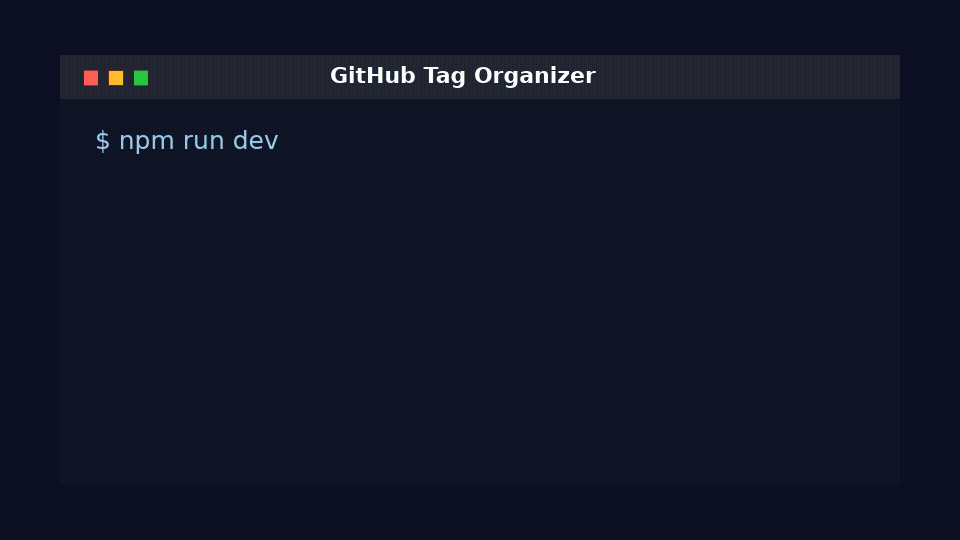

# 🏷️ GitHub Tag Organizer

[](https://opensource.org/licenses/MIT)
[](https://www.typescriptlang.org/)
[](https://nodejs.org/)
[](https://github.com/Inupedia/Github-Tag-Organizer/stargazers)

> 一个基于 TypeScript 的智能工具，使用大语言模型自动分类和整理你的 GitHub starred 仓库，并可自动创建/更新 GitHub Star Lists。

<p align="center">
  
</p>

<p align="center">
  <strong>Fetch starred repos -> LLM classify -> create missing Lists -> sync back to GitHub.</strong>
</p>

## ✨ 功能特性

- 🔍 **自动获取** - 通过 GitHub API 获取所有 starred 仓库
- 🤖 **智能分类** - 使用本地 LLM 进行智能分类和标签化
- 📝 **多种输出** - 生成文件系统列表、自动化脚本、手动指南
- 🎯 **GitHub Lists 自动同步** - 自动读取现有 Lists，缺失时创建，并把仓库加入对应分类
- 📊 **详细报告** - 生成完整的分类分析报告
- 🏷️ **多级分类** - 支持主分类和子分类的层次结构
- 🌐 **中英文模式** - 支持 `zh` / `en` 两种 CLI、LLM 提示和报告输出
- ⚡ **批量处理** - 支持大量仓库的批量处理
- 🔄 **重试机制** - 内置网络重试和错误处理

## 🚀 快速开始

### 环境要求

- Node.js >= 16.0.0
- 本地 LLM 服务（如 Ollama）
- GitHub Personal Access Token

### 安装

```bash
# 克隆项目
git clone https://github.com/Inupedia/Github-Tag-Organizer.git
cd Github-Tag-Organizer

# 安装依赖
npm install

# 构建项目
npm run build
```

### 配置

1. **复制环境变量文件**：
   ```bash
   cp env.example .env
   ```

2. **配置环境变量**：
   ```env
   # GitHub Personal Access Token
   GITHUB_TOKEN=your_github_token_here
   
   # Local LLM API endpoint
   LLM_API_URL=http://localhost:11435
   
   # LLM model name
   LLM_MODEL=deepseek-r1:32b

   # Output language: zh or en
   OUTPUT_LANGUAGE=zh
   
   # Maximum repositories to process (0 = all)
   MAX_REPOS=50

   # Automatically sync GitHub Star Lists (requires browser session cookies)
   SYNC_GITHUB_LISTS=true
   GITHUB_SESSION_COOKIES=_octo=...; user_session=...; logged_in=yes; ...
   GITHUB_LISTS_DRY_RUN=false
   ```

3. **获取 GitHub Token**：
   - 访问 [GitHub Settings > Personal Access Tokens](https://github.com/settings/tokens)
   - 创建新 token，选择权限：
     - `repo` - 完整仓库访问权限
     - `read:user` - 读取用户信息
     - `gist` - 创建 Gists（可选，用于高级功能）

### 运行

```bash
# 开发模式（推荐）
npm run dev

# 生产模式
npm run build && npm start

# 测试模式
npm test
```

## 📖 使用指南

### 基本使用

1. **运行脚本**：
   ```bash
   npm run dev
   ```

2. **查看结果**：
   - 文件系统列表：`github-lists/` 目录
   - 自动化脚本：`create-github-lists.js`
   - 手动指南：`github-lists-manual-instructions.md`
   - 详细报告：`organization-report.md`

3. **同步 GitHub Lists**：
   - 配置 `GITHUB_SESSION_COOKIES` 后，脚本会自动读取现有 Star Lists
   - LLM 会优先复用已有分类；如果没有合适分类，会自动创建新的 List
   - 每个 starred 仓库会被自动加入对应 GitHub Star List
   - 未配置 cookie 时，仍会生成本地文件和手动指南作为降级输出

### 高级配置

#### 处理大量仓库

```bash
# 处理所有仓库
MAX_REPOS=0 npm run dev

# 处理指定数量
MAX_REPOS=100 npm run dev
```

#### 自定义 LLM 配置

```env
# 使用不同的 LLM 服务
LLM_API_URL=http://your-llm-server:port
LLM_MODEL=your-model-name
```

#### 中英文模式

工具支持中文和英文两种输出模式，覆盖 CLI 日志、LLM 分类提示、备用分类名称、生成的报告和列表文件。

```bash
# 中文模式（默认）
OUTPUT_LANGUAGE=zh npm run dev

# 英文模式
OUTPUT_LANGUAGE=en npm run dev
```

也可以在 `.env` 中配置：

```env
OUTPUT_LANGUAGE=en
```

#### 自动同步 GitHub Star Lists

GitHub 目前没有官方 Star Lists 写入 API。为了实现全自动创建和归类，本工具会使用你浏览器中的 GitHub 登录会话调用 GitHub 网页端点。

1. 登录 [github.com](https://github.com)
2. 打开开发者工具（F12）→ Network
3. 刷新任意 GitHub 页面，选中一个 `github.com` 请求
4. 在 Request Headers 中复制完整 `Cookie` 值
5. 写入 `.env`：

```env
SYNC_GITHUB_LISTS=true
GITHUB_SESSION_COOKIES=_octo=...; user_session=...; logged_in=yes; ...
```

建议首次运行使用 dry-run 预览：

```bash
GITHUB_LISTS_DRY_RUN=true npm run dev
```

确认分类结果后再执行实际同步：

```bash
GITHUB_LISTS_DRY_RUN=false npm run dev
```

## 📁 项目结构

```
github-tag-organizer/
├── src/                    # 源代码
│   ├── github-client.ts    # GitHub API 客户端
│   ├── llm-client.ts       # LLM 客户端
│   ├── organizer.ts        # 核心组织逻辑
│   ├── file-based-lists.ts # 文件系统列表生成
│   ├── github-lists-manager.ts # GitHub Lists 管理
│   └── types.ts           # 类型定义
├── dist/                  # 构建输出
├── .env.example          # 环境变量示例
├── .gitignore            # Git 忽略文件
├── package.json          # 项目配置
├── tsconfig.json         # TypeScript 配置
└── README.md            # 项目说明
```

## 🛠️ 开发

### 开发环境设置

```bash
# 安装依赖
npm install

# 开发模式运行
npm run dev

# 构建项目
npm run build

# 清理构建文件
npm run clean
```

### 完善 GitHub 仓库主页

仓库主页的 description、homepage 和 topics 可以通过脚本统一更新：

```bash
GH_ADMIN_TOKEN=your_admin_token npm run repo:metadata
```

推荐展示信息：

- **Description**: `LLM-powered GitHub Star Lists organizer that automatically classifies starred repositories, creates missing lists, and syncs assignments.`
- **Homepage**: `https://github.com/Inupedia/Github-Tag-Organizer#readme`
- **Topics**: `github`, `github-stars`, `star-lists`, `llm`, `ai`, `typescript`, `automation`, `repository-management`, `starred-repos`, `github-api`, `ollama`, `openai`, `productivity`, `developer-tools`

### 代码结构

- **GitHubClient**: 处理 GitHub API 交互
- **LLMClient**: 处理本地 LLM 通信，并根据现有 GitHub Star Lists 输出目标分类
- **RepoOrganizer**: 核心组织逻辑
- **FileBasedListsClient**: 生成文件系统列表
- **GitHubListsManager**: 生成 GitHub Lists 工具
- **GitHubStarListsClient**: 自动创建 GitHub Star Lists 并同步仓库归类

## 📊 输出示例

### 分类结果

```
📊 Organization Summary:
  Web Development: 15 repositories
    └─ Frontend Frameworks: 8 repositories
    └─ Backend Tools: 7 repositories
  AI/ML Tools: 12 repositories
    └─ Machine Learning: 6 repositories
    └─ Data Processing: 6 repositories
  Productivity Tools: 8 repositories
    └─ Note-Taking: 4 repositories
    └─ System Utilities: 4 repositories
```

### 生成的文件

- `github-lists/` - 分类文件目录
- `create-github-lists.js` - 自动化脚本
- `github-lists-manual-instructions.md` - 手动创建指南
- `organization-report.md` - 详细分析报告

## 🤝 贡献

欢迎贡献代码！请遵循以下步骤：

1. Fork 项目
2. 创建特性分支 (`git checkout -b feature/AmazingFeature`)
3. 提交更改 (`git commit -m 'Add some AmazingFeature'`)
4. 推送到分支 (`git push origin feature/AmazingFeature`)
5. 打开 Pull Request

## 📝 许可证

本项目采用 MIT 许可证 - 查看 [LICENSE](LICENSE) 文件了解详情。

## 🙏 致谢

- [GitHub API](https://docs.github.com/en/rest) - 提供仓库数据
- [Octokit](https://github.com/octokit/octokit.js) - GitHub API 客户端
- [Ollama](https://ollama.ai/) - 本地 LLM 运行环境

## 📞 支持

如果你遇到问题或有建议，请：

1. 查看 [Issues](https://github.com/Inupedia/github-tag-organizer/issues)
2. 创建新的 Issue
3. 联系维护者

---

⭐ 如果这个项目对你有帮助，请给它一个星标！